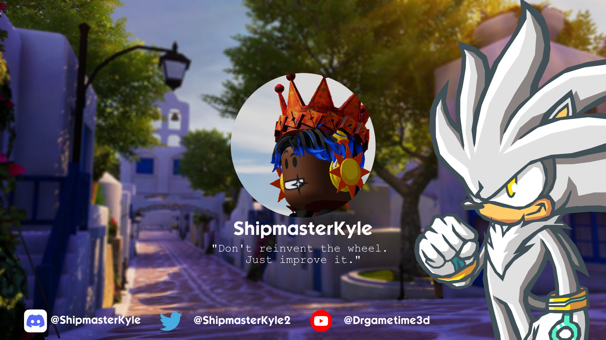

Hi! I'm Ship aka Gabriel, a self-taught programmer currently leading development on the Cubix Infinite. I started programming back in 2019 and am currently studying Computer Science at Fort Valley State University to polish my skills. I'm the founder and lead Software Engineer at Cubix Entertainment where I contribute to building a new indie console.

### My Work
1. [libfinite](https://github/com/CubixEntertainment/libfinite) - The developer library for doing anything with the Cubix Infinite
2. [Chao Engine](https://github.com/ShipmasterKyle/Chao-Engine) - The first fully functional Chao Garden in Roblox
3. [Hedgeburst Engine](https://www.roblox.com/library/8261922963/ShipmasterKyles-HedgeBurst-Engine-v3-6) - The Physics Engine for Sonic Earth
4. [Cubix Website](https://cubixdev.org/) - Website designed and built by me and LGM Productions for Cubix

### Contact
Want to commission me to work on your project or just want to talk?

- Discord: @shipmasterkyle
- Roblox: Drgametime3d
- Scratch: Drgametime3d
- Twitter: @ShipmasterKyle2
